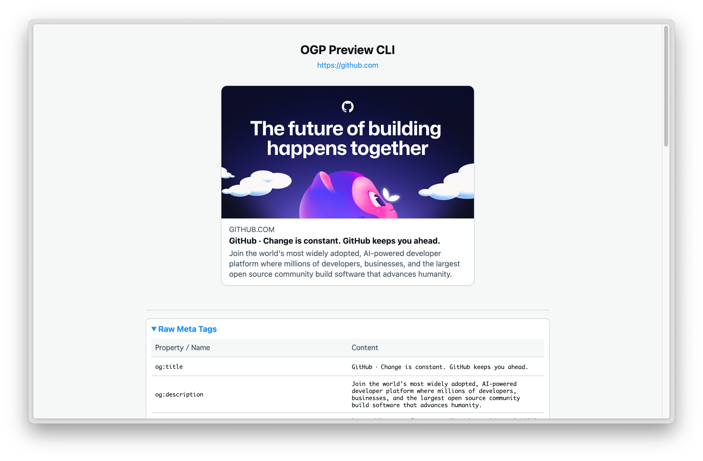

# OGP Preview CLI

<div align="center">
  <!--  -->
  <br>
  <h3>Open Graph Protocol (OGP) のローカルプレビュー＆デバッグツール</h3>
</div>

<div align="center">

[](https://opensource.org/licenses/MIT)
[](https://www.rust-lang.org)

[English](README.md) | [日本語](README.ja.md)

</div>

<div align="center">
  
  <p><em>(実際の動作画面)</em></p>
</div>

## 📖 概要

**ogp-preview** は、Webフロントエンドエンジニアやデザイナー向けのCLIツールです。開発中のローカル環境（Localhost）や公開サイトのOGP設定が、実際のSNS（X/Twitterなど）でどのように表示されるかを、デプロイやngrok等のトンネリングなしで即座にプレビューできます。

ページからOGPメタデータ（`og:title`, `og:image` 等）を抽出し、相対パスの画像を自動解決した上で、Twitterの「Summary Card with Large Image」風のデザインで表示します。

## ✨ 特徴

- **🚀 Localhost完全対応**: ローカルサーバー（例: `http://localhost:3000`）上のページもそのままプレビュー可能。
- **🖼️ リアルなプレビュー**: Twitter/X のカードデザイン（ライトテーマ）を再現。長いテキストの省略表示もシミュレート。
- **🔍 詳細デバッグ**: 抽出された全てのメタタグをテーブル表示し、設定ミスの発見をサポートします。
- **🔗 相対パス自動解決**: `/images/ogp.png` のようなパスも、自動的に絶対URLに補完して表示します。
- **🛠️ 簡単操作**: コマンド一発で起動し、Enterキーで終了＆クリーンアップ。

## 📦 インストール

前提: Node.js (v18以上)

### クイックスタート (インストール不要)

`npx` を使って直接実行できます：

```bash
npx github:syuya2036/ogp-preview https://github.com
```

### グローバルインストール

```bash
npm install -g github:syuya2036/ogp-preview
# or
yarn global add github:syuya2036/ogp-preview
```

インストール後は `ogp-preview` コマンドとして実行できます：

```bash
ogp-preview http://localhost:3000
```

## 🚀 使い方

### 基本的な使い方

URLを指定して実行します：

```bash
ogp-preview http://localhost:3000/blog/my-new-post
```

### Localhost ショートカット

`-p` (ポート) オプションを使うと、入力を省略できます：

```bash
# http://localhost:3000/blog/1 として解釈されます
ogp-preview -p 3000 blog/1
```

### 公開URLの確認

通常のWebサイトのOGPも確認できます：

```bash
ogp-preview https://github.com
```

### 動作フロー
1. 上記コマンドを実行。
2. デフォルトブラウザが立ち上がり、プレビュー画面が表示されます。
3. カードの見た目や、デバッグエリアのメタ情報を確認します。
4. ターミナルで **Enter** を押すと、一時ファイルを削除して終了します。

## 💻 開発者向け情報

### セットアップ

```bash
git clone https://github.com/syuya2036/ogp-preview.git
cd ogp-preview
npm install
```

### 開発モードでの実行

TypeScriptソースを直接実行するには `npm run dev` を使用します：

```bash
npm run dev -- https://github.com
```

### ビルド

TypeScriptをJavaScriptにコンパイルする（dist/ディレクトリ生成）：

```bash
npm run build
```

## 🤝 コントリビューション

バグ報告や機能追加の提案は大歓迎です！

1. Fork してください
2. 機能ブランチを作成 (`git checkout -b feature/AmazingFeature`)
3. 変更をコミット (`git commit -m 'Add some AmazingFeature'`)
4. ブランチにプッシュ (`git push origin feature/AmazingFeature`)
5. Pull Request を作成してください

## 📝 ライセンス

MIT ライセンスの下で公開されています。詳細は `LICENSE` ファイルを確認してください。

---

<div align="center">
  Created by <a href="https://github.com/syuya2036">@syuya2036</a>
</div>
